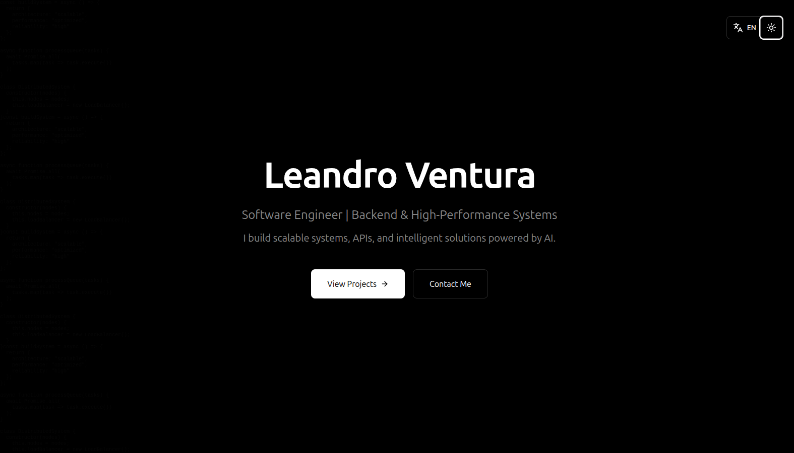

# Leandro Ventura - Portfolio

  

My personal portfolio built with **React + TypeScript + Tailwind CSS + Framer Motion**.

This presents my experience as a Software Engineer specializing in Backend, high-performance systems, and scalable architecture.

## The portfolio

- **Modern design** with animated Dark/Light toggle theme
- **Multilingual support**: Portuguese and English (with react-i18next)
- **Smooth animations** with Framer Motion
- **Fully responsive** (mobile-first)
- **Clean and well-organized code**
- **Easy to maintain** and expand

## Stack

- **React 18** + **TypeScript**
- **Tailwind CSS** (support a dark mode)
- **Framer Motion** (animations)
- **Lucide React** (ícons)
- **react-i18next** (internationalization)
- **Vite** (build tool)

## Main Sections

- **Hero** – Main Introduction
- **About** – Who I am and professional focus
- **Skills** – Languages, Frameworks, Systems, Databases, and DevOps
- **Featured Project** – Deepfake Detection System (highlight)
- **Other Projects** – Micro SaaS, Enterprise Systems, API Integration, Data Pipeline
- **Engineering Approach** – Systems development philosophy
- **Contact** – Direct links (Email, LinkedIn, GitHub)

